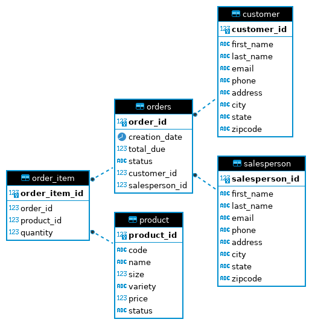

# Introduction
(50-100 words)
The JDBC app project was done in order to get familiar with JDBC and data access-designed patterns such as DAO and Repository design. JDBC allows a connection between a Java application and a RDBMS (PostgreSQL database). The project implemented CRUD operations (create, read, update, delete) to manipulate data.

## What are the technologies used?
- **Git**: code management and storage
- **JRV**: remote desktop
- **Docker**: PSQL instance provisioning
- **PostgreSQL**: database
- **DBeaver**: database management
- **JDBC**: connection between Java app and database
- **MVN**: dependency management

# Implementation
## ER Diagram

## Design Patterns
The DAO (Data Access Object) and Repository design patterns are ways to abstract the data storage and retrieval logic from the rest of the application.

The DAO design pattern creates an object which provides an interface to access and  manipulate data. Furthermore, it can manage the connection to the database, execute SQL queries, amongst other things. The DAO pattern also provides an interface for CRUD operations on the data.

The Repository pattern creates a more high-level interface to access and manipulate data. Indeed, the design pattern provides a central place to manage these actions. It can perform methods such as query, add, update and remove data entities.
# Test
The JDBC application was manually tested to ensure its accuracy. To set up the database, a PostgreSQL database in a Docker container was created.  The test data was loaded into the database using `psql -h <hostname> -p <portnumber> -U <username> -f database.sql` and  `psql -h <hostname> -p <portnumber> -U <username> -d <databasename> -f <filename>.sql` for all the SQL files. The tables were also imported into DBeaver. 
The CRUD operations implemented in the JDBC were tested by running queries manually and compared with the expected results.
